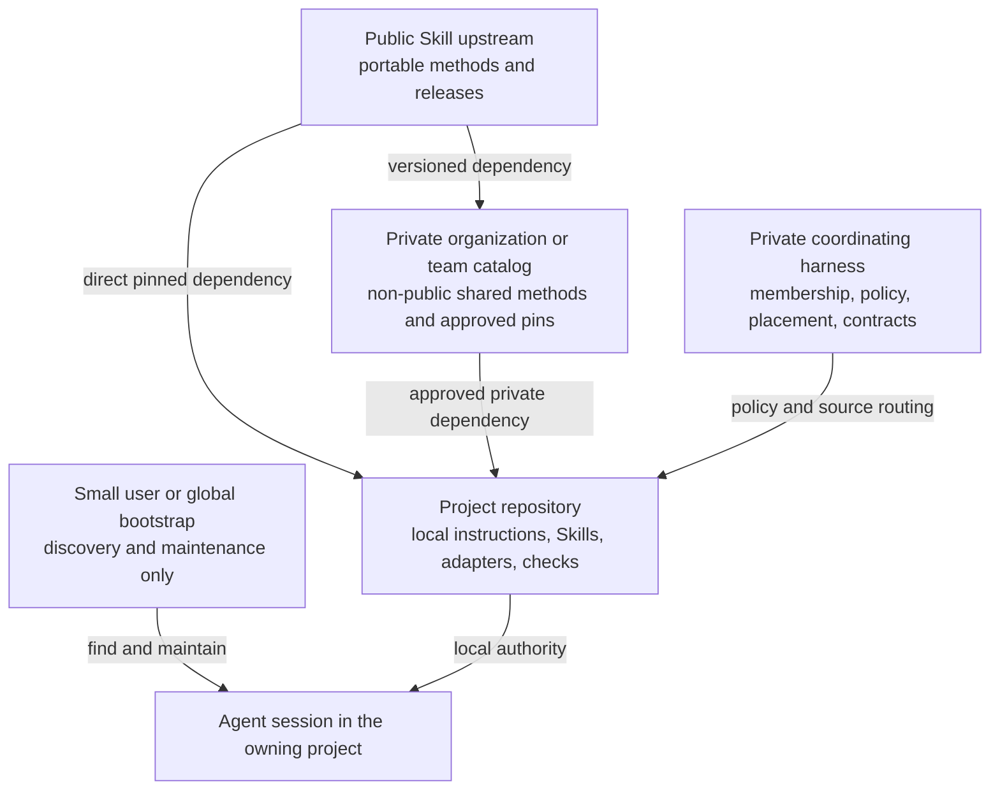
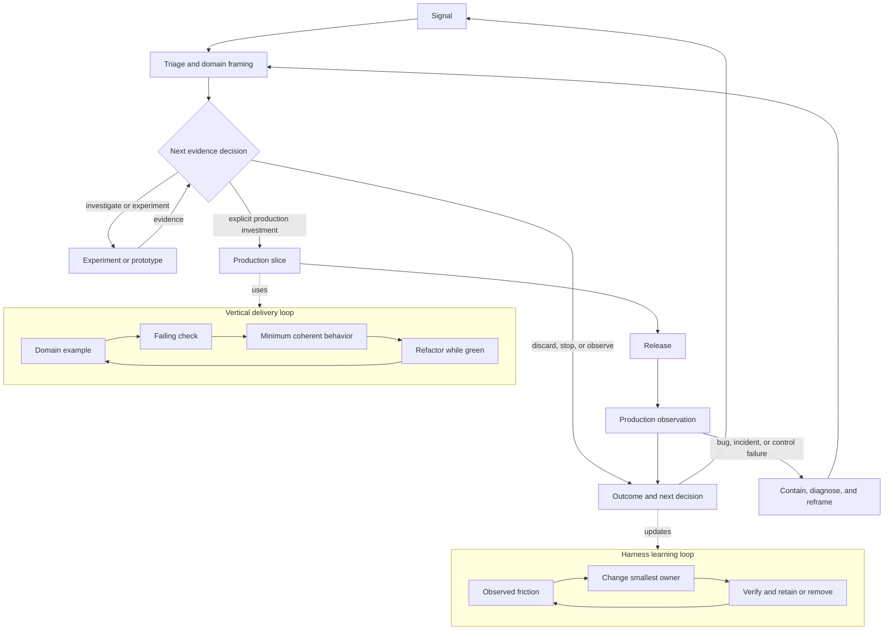

# Human Guide to Agentic Engineering Harnesses

Start here to understand what the human owns, what an agent can close, and where
autonomy stops. The same model works for one repository, several repositories,
or several teams without turning the catalog into a central control plane.

This guide is the human map. Repository instructions, harness contracts,
checks, and Skills still control agent behavior. The links point to those
owners.

## Executive Summary

A harness makes the real work easier to see and safer to change. The smallest
useful version gives an agent:

- enough authoritative context to understand the current task
- explicit scope, permissions, decision rights, and stop conditions
- real commands and checks for the technology actually present
- feedback from tests, delivery, production, incidents, and outcomes
- recovery, rollback, observability, and human veto where needed
- a durable route for learnings and system improvement across sessions

The goal is reliable behavior from any member repository and supported coding
host without copying policy everywhere. Every repository has a local entrypoint
and keeps authority over its own product and implementation. A coordinator adds
only the relationships, shared state, and checks that no member can own alone.

## The Invariants

| Invariant | Why |
|---|---|
| Start in the repository that owns the change | Local instructions, checks, permissions, and architecture are authoritative there |
| Every listed repository has a local agent entrypoint | A session must degrade safely even in an experiment or partial checkout |
| Session discovery and autonomy are separate | Reading the right policy must never silently grant broader permissions |
| Canonical truth has one owner | Duplicated prompts, wikis, and copied rules drift |
| Coordinators own relationships, not member-local truth | Centralization must not erase product, domain, team, or security authority |
| Agent-facing artifacts are agent-native | Agents need explicit routes, contracts, commands, state, and actionable failures rather than human ceremony |
| Human documentation is a projection | Humans can understand and review the system without making narrative prose the execution path |
| Chat uses the human's preferred language | Collaboration should fit the user |
| Persistent artifacts use US English by default | Code, tests, schemas, prompts, commits, and documentation stay portable and consistent across teams and tools |
| Skills are routed from the goal | Users should not need to know Skill names or prescribe a stack |
| Quality, security, compliance, and operability start left | They are design and learning inputs, not downstream approval departments |
| Git is memory, audit trail, comparison, and rollback | Chat history is neither durable nor reviewable enough |
| Currentness is part of correctness | Models, hosts, plugins, standards, prices, and community practices change |
| Every mechanism has an exit path | A harness must be able to remove, supersede, or rebuild stale structure |

## What Is Agent-Native

Agent-native does not mean opaque or unaccountable. It means canonical
artifacts are optimized for reliable machine navigation and action:

- one discoverable instruction entrypoint
- explicit source authority and precedence
- small context routes instead of bulk prompt loading
- real executable commands instead of prose approximations
- structured state with owner, freshness, and stop condition
- deterministic checks with actionable failure output
- explicit permission and external-write boundaries
- recovery and rollback before higher autonomy
- references to canonical owners instead of copied policy

A README can explain the system to a human. It should not become a second copy
of the agent workflow. The target-state rules live in
[`scaffold-harness/REFERENCE.md`](./skills/engineering/scaffold-harness/REFERENCE.md).

## Topology Selection

The harness selects the smallest topology that matches real ownership.
Topology does not determine autonomy.

### Single Repository

Use a repository-local harness when one repository owns the relevant behavior
and its delivery boundary.

Minimum reliable shape:

```text
AGENTS.md       stable agent entry, scope, commands, boundaries
README.md       human purpose and usage
tests / CI      real Fast Check and Full Gates
```

Add `CONTEXT.md`, `LEARNINGS.md`, ADRs, status, local Skills, Hooks, or MCP only
when observed work needs them. Do not create a coordinator for a single clear
authority boundary.

### Multiple Repositories

Use a coordinating repository when durable work spans provider/consumer
contracts, dependency order, shared workflow state, cross-cutting policy, or
integration verification.

Each member still owns:

- local architecture and domain facts
- implementation and current worktree state
- commands, tests, CI, release, and recovery
- repository permissions and security boundaries
- local decisions, learnings, and product state

The coordinator may own:

- membership and repository relationships
- public contracts and compatibility ranges
- provider, consumer, and owner mappings
- shared oversight and autonomy policy
- cross-repository workflow state and stop conditions
- integration checks, evals, release evidence, and recovery coordination
- session discovery and write-back rules

Every member points to the coordinator through a small `AGENTS.md` section.
The pointer prefers a local sibling and includes a stable remote fallback. If
neither is available, the agent continues only reversible member-local work and
does not infer cross-repository authority.

The same pointer resolves the shared Skill catalog locally first and through a
stable remote repository fallback second. If neither route is reachable, the
agent continues without shared Skills and does not invent their procedures.

### Multiple Teams

A multi-team harness is a federation, not a larger central prompt.

Each team keeps authority for its bounded contexts, repositories,
implementation, checks, delivery choices, and local operating state. The
federation adds only the relationships no team can own alone:

- team or role ownership for bounded contexts and public contracts
- provider and consumer responsibilities
- semantic, security, risk, release, and autonomy decision rights
- shared policy and Skill versions with adoption evidence
- cross-team compatibility tests and outcome evals
- escalation for contract breakage, incidents, or conflicting priorities

The coordinator never becomes every team's product manager, domain expert, or
backlog. Prefer Git-owned asynchronous contracts and checks over recurring
coordination meetings. Add a software catalog, relationship graph, or policy
engine only after scale causes a demonstrated discovery or enforcement failure.

## How Any Session Starts Safely

The session algorithm is intentionally boring:

```text
open working repository
-> enter through the current host bridge and read nearest AGENTS.md
-> inspect Git status and worktrees
-> load local sources and real commands
-> load coordinator HARNESS / SYNC when the pointer requires it
-> resolve only task-matching Skills
-> discover current host capabilities and permissions
-> perform the smallest authorized learning or delivery loop
-> run member-local checks
-> review, commit, push, and route durable evidence
```

The local repository always wins for local product and implementation truth.
The coordinator wins only for its named cross-repository concerns. Higher-level
instructions cannot invent semantics or authority that the member does not
grant.

Experimental repositories use the same discovery path. They remain
human-in-the-loop until committed history, named checks, recovery, permissions,
and representative evidence justify a higher level.

## Human and Agent Operating Model by Delegation Level

The levels describe the widest unit of work that a harness can delegate
reliably in one decision domain. They are not a score for the whole company, a
property of the model, or a required sequence of tool purchases. Product
discovery, repository maintenance, release, security, and portfolio decisions
may operate at different levels. The weakest required dimension constrains the
safe level for that decision.

At every level, people remain accountable for delegated outcomes and retain
every authority they have not explicitly delegated. Agents should autonomously
close routine reversible work inside documented boundaries, including review,
commit, and push when the repository authorizes them. They escalate unresolved
intent, semantics, authority, material risk, sensitive or irreversible effects,
and any failed control needed for the delegated unit.

### L1 - Direct Task

- **How the human uses agents:** Frame one bounded task, provide missing intent,
  and review the result directly.
- **How agents work technically:** Use transient session context, inspect the
  target, make the smallest authorized change, run the relevant check, and
  return evidence. No durable orchestration is implied.
- **How agents work methodically:** Use a short inspect-hypothesize-change-check
  loop. A disposable spike is valid when it is the cheapest way to answer an
  uncertainty, but it is not silently promoted to production.
- **Why this is ideal here:** A one-off task does not justify permanent
  instructions, state, memory infrastructure, or automation. Direct human
  review matches the small unit and unknown reliability.
- **Consider L2 when:** A procedure recurs often enough that versioning and
  evaluating it could reduce variance or repeated explanation.
- **Graduate only after:** The versioned procedure outperforms unstructured
  prompting on representative examples under human supervision.

### L2 - Repeatable Procedure

- **How the human uses agents:** Choose the procedure, supply task-specific
  inputs, supervise consequential branches, and compare repeated outcomes.
- **How agents work technically:** Load one versioned Skill, Rule, or concise
  instruction; follow its inputs, outputs, checks, and stop conditions; retain
  evidence from representative runs.
- **How agents work methodically:** Repeat an understood feedback loop, not a
  frozen solution. Improve the procedure from actual failures and examples.
- **Why this is ideal here:** It removes prompt folklore and makes a recurring
  method testable without building repository-wide state or orchestration.
- **Consider L3 when:** Context, decisions, checks, domain language, or
  learnings must survive sessions in one repository.
- **Graduate only after:** Canonical sources, owners, a real Fast Check and Full
  Gates, and the cross-session learning route are discoverable and work in a
  representative repository task.

### L3 - Living Repository

- **How the human uses agents:** Express intent, own product and domain
  semantics, decide material trade-offs, and review evidence or exceptions.
  Routine repository stewardship belongs to the agent.
- **How agents work technically:** Enter through `AGENTS.md`; route to canonical
  context, status, ADRs, and learnings; respect Git worktree state; use a real
  Fast Check and Full Gates; persist durable lessons in the owning artifact;
  commit and push ready routine work when policy allows.
- **How agents work methodically:** Evolve ubiquitous language, bounded
  contexts, examples, contracts, vertical tests, and code together. Use TDD for
  production behavior and bounded prototypes or technical spikes to retire
  uncertainty before making a production investment.
- **Why this is ideal here:** Git-owned truth makes ongoing work recoverable,
  auditable, and portable across sessions without pretending that a complete
  specification or domain model can be known up front.
- **Consider L4 when:** The work needs an external source or action whose
  authority, access, currentness, failure behavior, and evidence must be
  controlled.
- **Graduate only after:** Sources, permissions, currentness, failure handling,
  audit evidence, and external-write boundaries are explicit and pass a
  representative controlled task.

### L4 - Grounded System

- **How the human uses agents:** Approve access and authority boundaries,
  define which external effects remain consequential, and decide material
  uncertainty the evidence cannot resolve.
- **How agents work technically:** Retrieve attributable sources; use APIs,
  MCP, plugins, browsers, or other tools through least privilege; record
  provenance and currentness; handle tool failure; keep external writes inside
  explicit authority and an auditable path.
- **How agents work methodically:** Test assumptions against primary evidence
  and small experiments. Shift quality, security, privacy, accessibility,
  compliance, operability, and recovery into framing and every implementation
  slice rather than deferring them to downstream review.
- **Why this is ideal here:** The agent can ground decisions and take useful
  actions without confusing access with permission or retrieval with canonical
  truth.
- **Consider L5 when:** A bounded end-to-end workflow needs durable state,
  retries, recovery, stop conditions, observability, and outcome evaluation.
- **Graduate only after:** Repeated workflow runs are observable, recoverable,
  idempotent where needed, safely stoppable, and evaluated against outcomes.

### L5 - Stateful Workflow

- **How the human uses agents:** Design and authorize the workflow, then handle
  exceptions, unresolved semantics, failed controls, and decisions outside its
  boundary.
- **How agents work technically:** Coordinate explicit durable state across
  sessions or repositories; make retries and writes idempotent where needed;
  isolate concurrent work; expose progress, cost, cancellation, recovery, and
  stop conditions; evaluate outcomes rather than only task completion.
- **How agents work methodically:** Pull the smallest valuable end-to-end slice
  through discovery, DDD modeling, TDD, integration, and feedback. Use FaST-like
  dynamic collaboration where people or agents need to swarm on the current
  constraint, but preserve named ownership and public contracts.
- **Why this is ideal here:** People stop manually carrying routine state and
  handoffs while retaining control of exceptions and semantics. The workflow
  can fail safely and resume instead of relying on chat history.
- **Consider L6 when:** One delivery domain has stable goals and risk classes,
  deterministic policy and quality gates, isolation, rollback, production
  feedback, incident ownership, and a valuable case for wider delegation.
- **Graduate only after:** Repeated bounded value-stream runs prove the gates,
  isolation, rollback, audit, production feedback, incident ownership, and
  effective human-on-the-loop intervention.

### L6 - Governed Value Stream

- **How the human uses agents:** Move to human-on-the-loop only for proven
  domains. Govern goals, risk classes, policy, budgets, and exceptions; retain
  veto, incident command, accountability, and the ability to stop the system.
- **How agents work technically:** Operate the bounded loop from attributable
  signal through triage, implementation, integration, release, canary or staged
  rollout, telemetry, incident and bug response, outcome review, and the next
  decision. Use isolated execution, least privilege, deterministic gates,
  rollback, audit evidence, and fresh-context critique where risk warrants it.
- **How agents work methodically:** Combine continuous discovery and delivery,
  DDD, vertical TDD, Shift-left DevSecOps, agile testing, evolutionary
  architecture, disposable spikes, and production learning. Specifications,
  tests, security, compliance, operability, and deployment evolve as feedback,
  not sequential departments.
- **Why this is ideal here:** Delivery autonomy is valuable only when the
  system can detect unacceptable outcomes, limit blast radius, recover, and
  make intervention timely. Merge or deployment alone is not L6.
- **Consider L7 when:** A bounded product or investment decision has trusted
  signals and a valuable case for adaptive delegation.
- **Graduate only after:** A bounded pilot proves customer, product, financial,
  and operational signals; experiment and data boundaries; investment and loss
  budgets; success, pivot, and kill criteria; accountable owners; an audit
  trail; and an effective human stop mechanism.

### L7 - Adaptive Product System

- **How the human uses agents:** Set strategic objectives, budgets, decision
  domains, ethical and legal boundaries, review cadence, and exceptions. Own
  portfolio accountability and stop or redirect the system when needed.
- **How agents work technically:** Select bounded problems, experiments, and
  investments from trusted signals; maintain decision and evidence trails;
  enforce experiment, data, cost, reliability, security, compliance, and loss
  limits; feed measured outcomes back into prioritization.
- **How agents work methodically:** Run hypothesis-driven product and portfolio
  learning. Prefer cheap prototypes and spikes for uncertain bets, discard them
  after learning or explicitly fund hardening, and evolve domain models and
  strategy from real outcomes rather than speculative completeness.
- **Why this is ideal here:** It applies adaptive capacity only where strategic
  intent, economics, evidence, accountability, and kill criteria are explicit.
  It does not imply an autonomous company or authority over every domain.
- **Remain bounded:** Different decision domains stay at lower levels whenever
  evidence or authority is weaker. Legal, employment, ethical, security, and
  strategic authority is never inferred from technical capability.

### Tools Support Levels; They Do Not Create Them

Local files, search indexes, context compression, MCP servers, memory services,
knowledge graphs, multi-agent workers, and CI runtimes are implementation
options. Add one only for an observed failure mode with an owner, authority,
pilot, evaluation, privacy boundary, rollback, and removal condition. Git-owned
context remains the baseline. A tool can make L3-L7 work possible for a bounded
case, but installed tools alone prove no level.

## Language Contract

The active repository instruction owns the human's preferred collaboration
language. A harness should infer an explicit preference or the language used in
conversation and ask once only when it remains unclear. Personal preferences
belong in host-native user state or documented untracked state unless the
repository intentionally shares the rule.

Persistent repository artifacts use US English and ASCII punctuation by
default. Chat language does not implicitly change code identifiers, comments,
tests, schemas, prompts, commits, or documentation. A human may explicitly
request another language for a named artifact.

## Host Portability

Canonical semantics stay host-neutral. Thin adapters map them to the active
host rather than copying policy into every client.

The portable baseline checked on 2026-08-01 is:

| Host | Thin entry | Canonical owner |
|---|---|---|
| Codex | native `AGENTS.md` discovery | `AGENTS.md` |
| Cursor | native root `AGENTS.md` rule loading | `AGENTS.md` |
| Pi coding agent | native context-file loading | `AGENTS.md` |
| Claude Code | `CLAUDE.md` with `@AGENTS.md` | `AGENTS.md` |
| Gemini CLI | `GEMINI.md` with `@AGENTS.md` | `AGENTS.md` |
| Google Antigravity | `.agents/rules/harness.md` pointing to the root owner | `AGENTS.md` |
| CI, Flue, or another non-interactive runtime | bounded workload adapter explicitly loads the root owner | `AGENTS.md` plus runtime policy |

The coordinator verifies the three repository bridge files for every listed
member, including experiments. Codex, Cursor, and Pi need no duplicate file.
CI and durable runtimes need a representative workload check because merely
having a repository file does not prove that the runner injected it.

At session start, inspect the effective behavior of the current host:

- instruction file discovery and precedence
- project, user, global, bundled, and plugin Skill scopes
- Rules and scoped instructions
- Hooks and deterministic event controls
- MCP tools, source authority, permissions, and approval boundaries
- model selection and worker/subagent controls
- sandbox, network, filesystem, secrets, and external-write permissions
- context limits, compaction, output filtering, and session persistence

Host behavior is not assumed equivalent. The adapter is retained only while a
representative check shows it still loads the canonical owners with the
expected precedence and permissions. Re-check evidence and sources through
[`CURRENTNESS.md`](./skills/engineering/scaffold-harness/CURRENTNESS.md) when a
host changes its loading behavior.

Non-interactive CI or durable runtimes additionally require bounded structured
input/output, least privilege, secrets policy, timeout, budget, cancellation,
idempotency, recovery, deterministic gates, telemetry, and retained evidence.
The runtime selection gate lives in
[`RUNTIMES.md`](./skills/engineering/scaffold-harness/RUNTIMES.md).

## Cost-Aware Model Routing

Model routing follows the work, not the parent session. Keep three capability
tiers in the canonical policy and map current provider models in the local
adapter:

| Tier | Use | Default review |
|---|---|---|
| Fast | Clear, repeatable extraction, inventory, formatting, or mechanical checks | Deterministic checks or bounded sampling |
| Balanced | Everyday implementation, research, debugging, and normal code review | Fresh context plus target checks |
| Frontier | Ambiguous decomposition, consequential integration, high-risk decisions, or material critique | Human boundary and independent evidence as the risk requires |

Default spawned workers to Fast or Balanced. Escalate a worker only after a
representative failure or when the task crosses a documented consequence
boundary. A Frontier reviewer can critique material output from cheaper workers;
routine review stays on the least expensive tier that preserves quality.
Independence comes from fresh context, different failure modes, and evidence -
not from a more expensive model name alone.

The tiers are portable; their adapters are not. Codex can use project defaults
and role-specific agents. Claude Code can select rolling aliases or IDs in agent
definitions or per invocation. Cursor custom subagents can carry their own model
selection. Gemini CLI custom subagents inherit the main-session model by
default, while built-in or explicitly overridden agents may route differently;
use per-agent configuration when a stable tier matters. Pi, CI agents, SDKs,
and later hosts get the same treatment only after their live controls are
verified.

For Codex, official guidance checked on 2026-08-03 maps Luna to clear repeatable
work, Terra to the everyday workhorse, and Sol to complex open-ended work. Those
names are one dated adapter, not the policy. Record requested and resolved model,
reasoning effort, representative results, checked date, and re-check trigger in
`ORCHESTRATION.md`. When a new model appears, evaluate it as a candidate before
promotion and update every affected active host separately. Do not copy provider
price tables into repository instructions.

## Artifact Ownership

| Concern | Typical owner |
|---|---|
| Stable agent behavior and scope | `AGENTS.md` or local equivalent |
| Harness evolution, review, and oversight | `HARNESS.md` |
| Confirmed domain language and invariants | `CONTEXT.md` or bounded-context owner |
| Repositories, teams, sources, contracts, relationships | `CONTEXT-MAP.md` |
| Member discovery and write-back | `SYNC.md` plus thin member pointers |
| Mid-flight cross-session state | `STATUS.md` |
| Accepted consequential trade-off | ADR |
| Durable evidence-backed observation | `LEARNINGS.md` in the owning repository |
| Repeated probabilistic procedure | Skill |
| Deterministic behavior | Test, CI, Hook, configuration, or platform control |
| Live external information or action | MCP/tool with explicit authority and permissions |
| Human explanation | README or reference document |

The source-routing model is detailed in
[`CONTEXT-ARCHITECTURE.md`](./skills/engineering/scaffold-harness/CONTEXT-ARCHITECTURE.md).

## Skill Architecture

The Skills repository is a portable capability catalog, not the control plane
for a target system.

Skill source and policy authority are separate. A public repository can own a
portable method without learning anything about a private product. A private
coordinator can decide which version its members use without becoming the
source of every Skill. A project-local adapter can add domain language and real
commands without forking the generic lifecycle.



The arrows show supply and routing, not blanket override order. The active
host's real precedence must be inspected. Semantic ownership follows the work:

| Layer | Owns | Must not own |
|---|---|---|
| Public upstream | Portable generic procedures, release tags, provenance, public compatibility | Private membership, product facts, credentials, or organization policy |
| Private organization or team catalog | Shared non-public procedures, approved versions, internal adapters, organization-specific controls | Every project's domain model or implementation truth |
| Private coordinating harness | Member relationships, shared policy, Skill placement, compatibility, cross-repository state and evidence | Portable upstream source or member-local product truth |
| Project repository | Local instructions, domain language, commands, wrappers, project-only Skills, checks, and permissions | A duplicate copy of every upstream procedure |
| User or global scope | A small reusable bootstrap and host-managed capabilities | Target policy, broad workflow collections, or hidden project dependencies |

Resolve the goal in the owning project first. Use a project-local Skill or
adapter for target semantics, then an explicitly managed private or public
dependency for the generic procedure. Keep only the bootstrap global. Pin
shared dependencies to an immutable version and resolved commit, preserve
local wrappers outside managed directories, and select one owner for each
workflow. Public availability grants neither private-system membership nor
additional autonomy.

The global bootstrap stays intentionally small:

- `scaffold-harness` establishes or repairs the work system
- `agent-sync` routes durable evidence and keeps it current
- `update-harness` reconciles versions, scopes, and collisions
- `grill-harness-with-docs` resolves material ambiguity and critiques resolved work
- `write-a-skill` owns portable Skill creation and revision

Install this bootstrap into the effective scope of every agent host that runs
sessions in the system. A shared Skill directory is useful only where the host
actually loads it. The public catalog currently install-tests Codex, Claude
Code, Cursor, and Gemini. Pi, CI, and later hosts remain candidates until a
target-owned adapter and representative bootstrap check pass. A host-bundled
Skill creator may supply native metadata, scaffolding, or validation, but it
does not replace `write-a-skill` as the portable owner.

Project-specific Skills stay project-local. Public complements are installed
only when the current task needs them and their source, version, permissions,
and compatibility are verified.

Stack portability comes from an acquisition loop, not from stripping useful
detail out of every Skill. Agents derive the target stack, combine common craft
with explicit technology profiles, reuse or pilot an owned capability, work
directly for a one-off gap, and create a project-local Skill only when repeated
work supplies examples and checks. Promotion follows audience and provenance:
portable behavior public, shared non-public behavior private, and target
semantics local. Humans decide only genuinely unresolved consequential
adoption, architecture, authority, security, cost, or risk branches.

## Product Engineering Loop

The product lifecycle is one closed value loop containing smaller learning,
delivery, operation, and stewardship loops. Evidence crosses the loop
boundaries; work does not wait for a phase-complete handoff.



### Use Only the Loop the Decision Needs

Higher levels wrap smaller proven loops; they do not make every task a product
initiative. Topology is independent: one repository can own a complete value
stream, while a multi-repository system can still operate at L3.

| Delegation level | Smallest useful loop | Typical boundary | Human involvement |
|---|---|---|---|
| L1 | Inspect -> change -> check | One bounded task | Direct framing and review |
| L2 | Input -> procedure -> evidence -> improve | One recurring method | Select and supervise the procedure |
| L3-L4 | Intent -> local context -> change -> repository gates -> durable learning | Usually one repository; controlled external sources at L4 | Own semantics, authority, and material trade-offs |
| L5 | State -> next step -> evaluation -> retry, recover, or stop | One stable workflow across one or more repositories | Design boundaries and handle exceptions |
| L6 | Signal -> frame -> experiment or slice -> release when warranted -> production evidence -> next decision | One governed value stream, regardless of repository count | Govern goals and risk; intervene on exceptions |
| L7 | Trusted signals -> bounded bets -> experiments -> outcomes -> investment decision | One accountable product or portfolio decision domain | Own strategy, budgets, kill criteria, and stop authority |

A single-repository L3 harness therefore needs only repository context, checks,
and learning. It does not need portfolio machinery. A multi-repository L5
workflow needs a coordinator for relationships and state, but not L6 release
authority. Select the loop from the delegated decision, then select the
topology from ownership.

### Pull Work from Evidence, Not from Inventory

Signals are not automatically backlog items. Triage decides whether to discard,
observe, investigate, contain, experiment, or deliver. A backlog can be useful
as a short visible pull queue, but it is neither a commitment ledger nor proof
of value. Large queues of elaborated work increase aging assumptions and make
finishing the plan look more important than learning.

Specifications, plans, and domain models are working boundaries. Write enough
to make the next decision, example, risk, or experiment testable. Revise them
when prototypes, implementation, users, or production expose new meaning. A
planning or specification Skill may support that bounded decision; it must not
turn the loop into specification -> implementation -> testing -> deployment.

Use a prototype or spike when it buys decisive knowledge more cheaply than
production design. End it with discard, another experiment, or an explicit
hardening investment. Use vertical TDD for behavior intended to survive. Pull
the next slice from current value, risk, and system constraints instead of
attempting to pre-plan a complete solution.

### Keep Roadmaps Honest

Use horizons as investment decisions, not schedule theater:

| Horizon | Meaning | Artifact discipline |
|---|---|---|
| Now | Current funded outcome, risk reduction, or next evidence decision | Limit work in progress, name the owner and investment boundary, and record displaced work |
| Next | Evidence-supported candidate without a delivery commitment | Keep enough context to compare it; promote only when evidence, capacity, and dependencies justify focus |
| Later | Deliberately coarse option | Do not elaborate detailed specs, estimates, or ticket sets while important uncertainty remains |
| Never | Explicit non-investment under current conditions | Record rationale, decision evidence, and a concrete trigger for reconsideration |

Raw signal, incident, request, or finding records may remain in the existing
intake system for provenance and triage; they are not investment commitments.
Only sufficiently sharp Now or Next work becomes a decision or delivery issue.
A decision or learning issue resolves one consequential unknown. A production
issue creates one observable vertical behavior change. A bug or control issue
may express value as a restored invariant or reduced risk, cost, support
burden, or blocked flow; it does not need a fake user story. Later remains
option space, and Never remains a decision record.

Horizons never imply dates. Distinguish an external deadline, observation or
review date, forecast, and commitment. Record the source and owner of a real
constraint and the assumptions, confidence, and reforecast trigger of a
forecast. Use milestones only for real coordination, external, release, or
outcome boundaries - not arbitrary bundles of hoped-for features.

### Phase-by-Phase Human and Agent Collaboration

The operating level determines how much of this loop is delegated. The phase
determines what the human and agent do inside that envelope.

| Phase | Human role | Agent technical operation | Engineering method | Why this allocation works |
|---|---|---|---|---|
| Signal and observation | Set objectives, accountable outcomes, allowed sources, privacy and retention boundaries, and any listening exclusions | Collect attributable customer, product, operational, incident, security, compliance, cost, and commercial evidence; deduplicate, correlate, and preserve provenance and currentness | Treat signals as evidence, not requirements; look for patterns, counter-evidence, and affected bounded contexts | The human supplies purpose and legitimate authority while the agent handles breadth and traceability without turning volume into priority |
| Triage and domain/problem framing | Decide priority, risk appetite, strategic fit, decision owner, and material domain semantics | Map the bounded context, actors, examples, invariants, dependencies, uncertainty, data classification, threat and abuse cases, operability needs, and proportional controls | DDD discovery, explicit hypotheses, example mapping, Shift-left DevSecOps, privacy, accessibility, compliance, and agile testing | The most expensive mistake is solving the wrong problem or crossing an authority boundary; framing makes the next learning step small and testable |
| Spike, prototype, or experiment | Approve the learning question, time and loss budget, allowed data, success, pivot, and stop criteria | Create an isolated disposable implementation, synthetic or approved dataset, measurement path, and evidence record; prevent production credentials, unsupported dependencies, or silent promotion | Cheapest decisive experiment, technical spike, walking skeleton, or prototype; discard, iterate, or explicitly fund hardening | Agents make prototypes cheap, so uncertainty should be tested rather than hidden in speculative specifications or architecture |
| Production slice | Own material trade-offs and acceptance boundaries; resolve semantics the evidence cannot settle | Work in an isolated branch or worktree when needed; evolve domain examples, public contracts, failing tests, minimal code, telemetry, controls, migration and recovery in one vertical slice; run Fast Check and self-review | DDD and vertical TDD, evolutionary architecture, agile testing, refactoring, security and operability by construction | Small end-to-end slices expose integration and design feedback early while keeping changes understandable and reversible |
| Integration and release | Decide only exceptions or unusually critical releases; retain veto for unresolved material risk | Run Full Gates, contract and compatibility checks, fresh-context review when triggered, policy gates, migration rehearsal, staged rollout, rollback proof, evidence capture, commit and push | Continuous integration and delivery, small batches, least privilege, canary or feature control, risk-proportional review | Deterministic controls close routine work autonomously; staged exposure and rollback bound the cost of a wrong result |
| Operation and observation | Own service and product objectives, alert and risk thresholds, customer promises, and intervention policy | Observe reliability, adoption, behavior, cost, security, control effectiveness, and business outcomes; correlate releases with effects; flag threshold breaches and weak evidence | Production telemetry as design feedback, SLO and outcome review, hypothesis comparison, currentness checks | A delivered feature is only a hypothesis; operation reveals whether it creates value safely and sustainably |
| Incident, defect, or control failure | Retain incident command, material risk acceptance, external communication, and regulatory or contractual decisions | Detect, contain, gather evidence, reproduce, identify root cause, rollback or mitigate, implement a regression-first fix, verify recovery, and update checks, runbooks, context, or controls | Blameless causal learning, root-cause repair, regression TDD, resilience and threat learning | Fast automated evidence and repair support the human authority needed for high-consequence decisions and turn failures into prevention |
| Outcome and next decision | Decide keep, change, pivot, stop, or invest; govern budgets and portfolio trade-offs | Compare expected and observed customer value, reliability, security, compliance, cost, adoption, and control effectiveness; retain the decision trail and propose the smallest next bet | Empirical product review, kill criteria, economic and domain learning, bounded portfolio adaptation | It closes the loop on outcomes rather than output and prevents automated delivery from becoming a faster feature factory |

Specifications, tests, security, compliance, operability, and deployment are
feedback activities inside the loop, not sequential departments.

DDD keeps ubiquitous language, bounded contexts, invariants, events, and public
contracts aligned with examples, tests, code, and production evidence. Domain
models evolve when learning changes meaning.

A disposable prototype or spike has a hypothesis, timebox, isolation, and exit
decision. It is discarded, iterated, or followed by an explicit production
investment. It is never silently promoted.

Production behavior grows through vertical TDD at a public seam: concrete
domain example, failing behavior test, minimal implementation, refactor, and
observable rollout. Behavior tests use Given/When/Then semantics without
requiring a particular test framework or comment style. Testing is design
feedback, not a phase after coding.

End-to-end craft does not mean one giant generalist Skill. `frontend-craft`
and `backend-craft` remain independently installable profiles, while
`coding-discipline` owns their shared method. UIs stay thin, read models are
shaped for the task, and mutations express intent instead of leaking storage
records. Hexagonal architecture, CQRS, languages, frameworks, and relational,
document, graph, or other databases remain tools. Consequential choices earn
their place through bounded spikes with representative data, concurrency,
failure, resource, recovery, and cost evidence.

The canonical procedure is
[`run-product-engineering`](./skills/product/run-product-engineering/SKILL.md).

## Shift-Left Assurance and Compliance

Quality, security, privacy, accessibility, compliance, operability, telemetry,
recovery, and audit evidence enter during framing and every implementation
slice. The current risk determines the cheapest decisive check.

Compliance uses Git-owned control mappings, implementation decisions, evidence
references, review history, tests, CI results, release records, and monitoring
where sensitivity permits. Git is an evidence source, not a replacement for an
official assessment, certification, customer, or payment-industry form.

Agents may assemble and validate evidence. They do not infer regulatory scope,
accept risk, fabricate evidence, or make assurance claims without the named
authority.

## Autonomy and Human Oversight

Autonomy expands one bounded workload, repository, permission class, or risk
class at a time. Tool availability alone never grants authority.

Routine, reversible, policy-covered work should complete autonomously,
including intentional commit and push when the repository authorizes it. Ask a
human when intent or authority is unresolved, or an action is external,
irreversible, sensitive, destructive, or materially risky.

Human-on-the-loop operation requires:

- explicit scope, owner, permissions, inputs, outputs, and stop conditions
- checks or evals that detect meaningful failure
- bounded cost, duration, concurrency, retries, and side effects
- recovery, rollback, cancellation, and idempotency where needed
- observability, auditability, and intervention path
- repeated representative evidence

The human retains veto and accountability for consequential decisions.

### Shared Understanding and Grilling

Every significant topic starts by aligning the outcome, scope, non-goals,
authoritative sources, decision rights, assumptions, unknowns, checks, stop
conditions, and recovery. The same frame closes the topic so a fresh human or
agent can independently state what is true, what changed, why it is complete,
and what remains open.

Agents investigate discoverable facts and test bounded reversible hypotheses
without asking for permission. Resolved material decisions and changes receive
fresh-context agent critique. Humans are grilled one dependent decision at a
time only when intent, semantics, authority, consequential trade-offs, or
material risk remain genuinely unresolved. This loop applies to product,
domain, engineering, architecture, operations, security, compliance, and the
harness itself. Narrow reversible work may close through grounding,
self-review, and deterministic checks; always having a loop does not mean
always creating reviewer theater.

## Git and Worktree Stewardship

Before editing, inspect `git status` and available worktrees, then apply the
branch gate and isolation default from **Git Working Tree Hygiene**. Dirty
paths and unexpected worktrees belong to someone until proven otherwise. Do
not silently overwrite, reset, delete, or reclaim foreign work.

Confirm the current branch is correct for the work, or create a dedicated task
branch with an ordinary descriptive name (no agent/tool prefixes such as
`codex/`, `claude/`, or `cursor/`). Do not edit shared integration branches in
place for non-trivial work. Default to an isolated workspace: prefer the
host's native tool, otherwise a project-local ignored `.worktrees/` directory.
Stay put only when already isolated on the correct branch, or for a trivial
single-path edit on an already-correct clean task branch. Claim new worktrees
with `.agent-lease` and a STATUS lease row when STATUS exists. Remove only
worktrees this session claimed. Never delete or move another agent's live
worktree. List foreign orphans; reclaim only with explicit human confirmation.

At completion:

- run the relevant checks
- review scope and non-goals
- stage only intended paths
- commit and push routine ready work when policy permits
- report remaining foreign WIP or blocked integration

Git history provides review, comparison, audit, rollback, and session survival.

## Review Architecture

Reviews exist only when they can change an action:

- self-review plus deterministic checks for significant changes
- fresh-context independent review for every resolved material decision or
  change, including public methods and Skill semantics
- harness review after friction, drift, failed instructions, or harness changes
- currentness review when a decision consumes volatile evidence or an active
  adapter no longer matches observed behavior
- autonomy review before widening permissions, blast radius, or oversight mode

Every review ends with keep, change, remove, supersede, rebuild, or explicit no
action. Standing reviewers and documents that cannot change the next action are
ceremony, not assurance.

## Currentness and Self-Renewal

Currentness is part of correctness, but it is not a scheduled research ritual.

Record volatile decisions with source, checked date, live environment,
representative evidence, maximum evidence age, and event trigger. Expired
evidence becomes stale. It is refreshed when a decision or active adapter
consumes it, not merely because a calendar changed.

Triggers include host or provider changes, model availability or behavior,
plugin/Skill/Rule/Hook/MCP precedence changes, major client updates, changed
standards or assurance routes, and local quality, latency, retry, or spend
thresholds.

Dependency automation tracks the ecosystems actually in use. Prefer the latest
supported stable LTS runtime line where one exists and the current stable line
otherwise. Routine updates wait through a short supply-chain cooldown;
security updates do not. Actions and images stay pinned where integrity or
reproducibility requires it. Deprecation and forced-runtime annotations fail
the currentness loop instead of being suppressed.

Run a future LTS candidate only in a separate preview lane until upstream marks
it LTS. Keep that lane non-production and non-blocking unless the repository
explicitly accepts the risk. Promotion requires representative ecosystem checks
and the normal cooldown after the stable LTS release.

A currentness review may retain, modify, remove, supersede, or rebuild the
harness owner. Existing structure has no right to survive when replacement is
the smaller reliable system.

## Context, Memory, and Discovery Tools

Git-owned sources, checks, contracts, ADRs, and learnings remain authoritative.
External memory, search, code graph, catalog, RAG, and compression tools may
improve findability or context economy. They do not gain decision authority by
default.

Before adopting one, identify:

- the observed information-class failure and its frequency
- why improved Git owners are insufficient
- authority, data scope, privacy, read/write policy, and approval boundary
- representative pilot tasks and success signals
- freshness, failure behavior, export, deletion, rollback, and removal path

Stop at the first capability that solves the demonstrated problem. The gate is
[`CAPABILITY-GATES.md`](./skills/engineering/scaffold-harness/CAPABILITY-GATES.md).

## Member Lifecycle

### Admit an Experiment

1. Create or identify the repository and preserve its local truth.
2. Add it to the coordinator inventory.
3. Add a local `AGENTS.md` entrypoint immediately.
4. Point it to local and remote coordinator sources.
5. Name real available checks without inventing missing gates.
6. Keep it experimental and human-in-the-loop.
7. Run coordinator Full Gates and commit member/coordinator changes separately.

### Graduate to Active

Graduate only when the member has:

- committed Git history and recovery path
- real Fast Check and Full Gates
- working local and remote coordinator discovery
- clear product, architecture, security, and operational authority
- representative evidence for the intended autonomy level

Session safety is mandatory from admission. Unattended autonomy is earned later.

### Remove or Split a Member

Update relationships, consumers, contracts, status, checks, and human maps in
the same loop. Never silently delete a repository or foreign worktree. Preserve
audit and migration evidence required by consumers.

## Verification Model

A multi-repository Full Gate should verify at least:

- every mapped path exists
- no repo-like sibling is silently outside the inventory
- every listed member has a local agent entrypoint
- every pointer can locate local and stable remote coordinator sources
- every member loads the correct active, experimental, or catalog policy
- product members can discover the shared Skill catalog
- copied snippets and projections have not drifted
- all referenced commands and local files exist
- changed members pass their own Fast Check and Full Gates
- public contracts and compatibility checks pass for cross-repository work
- multi-team decision rights and escalation remain explicit

Coordinator checks complement member checks. They never replace them.

## Safe Degradation

When information or capability is unavailable:

- missing coordinator: continue only reversible member-local work
- missing current external evidence: reduce scope or defer the volatile decision
- missing adequate model: reduce scope or autonomy; do not compensate with a
  larger prompt
- missing check or recovery: keep a human in the loop
- conflicting authority: stop the dependent branch and resolve the owner
- dirty foreign work: isolate or leave it untouched
- stale adapter: disable or replace it before relying on higher autonomy

## Common Anti-Patterns

- one giant system prompt copied into every repository
- a central coordinator that owns member product truth
- a Skills catalog used as the target control plane
- treating repositories, deployables, teams, and bounded contexts as identical
- comprehensive specifications frozen before implementation
- tests, security, compliance, or observability added after coding
- prototypes silently becoming production
- global Skill installation for every possible workflow
- introducing MCP, memory, graphs, or catalogs without an observed failure
- asking the human to approve routine commit or push
- expanding autonomy because a new model or framework exists
- retaining stale harness structure because migration feels inconvenient

## Canonical Owners in This Repository

- Harness assessment and evolution:
  [`scaffold-harness`](./skills/engineering/scaffold-harness/SKILL.md)
- Multi-repository and multi-team context:
  [`scaffold-distributed-context`](./skills/engineering/scaffold-distributed-context/SKILL.md)
- Durable evidence routing:
  [`agent-sync`](./skills/engineering/agent-sync/SKILL.md)
- Skill installation and scope hygiene:
  [`update-harness`](./skills/engineering/update-harness/SKILL.md)
- Unresolved decisions:
  [`grill-harness-with-docs`](./skills/engineering/grill-harness-with-docs/SKILL.md)
- Product lifecycle:
  [`run-product-engineering`](./skills/product/run-product-engineering/SKILL.md)
- Compliance integration:
  [`integrate-product-compliance`](./skills/product/integrate-product-compliance/SKILL.md)
- Practical operating instructions:
  [`HARNESS-OPERATIONS.md`](./HARNESS-OPERATIONS.md)

## Why This Shape Works

The system favors explicit local authority, short feedback loops, and reversible
mechanisms because agents are fast at generating and changing artifacts but can
also act quickly on wrong context. Reliability therefore comes less from a
perfect prompt and more from source ownership, bounded permissions, executable
feedback, recovery, and repeated production learning.

Thin pointers allow a session to begin anywhere without copying shared policy.
Local ownership prevents the coordinator from hallucinating product truth.
Versioned Skills make good procedures reusable without turning them into
mandatory ceremony. Git makes decisions and evidence inspectable across time.
Currentness triggers let the harness evolve with the ecosystem without
performing research that has no consumer.

The result is not a fixed final architecture. It is a self-correcting operating
system that can remain small in one repository, coordinate several
repositories, federate multiple teams, and replace its own mechanisms when the
evidence changes.
